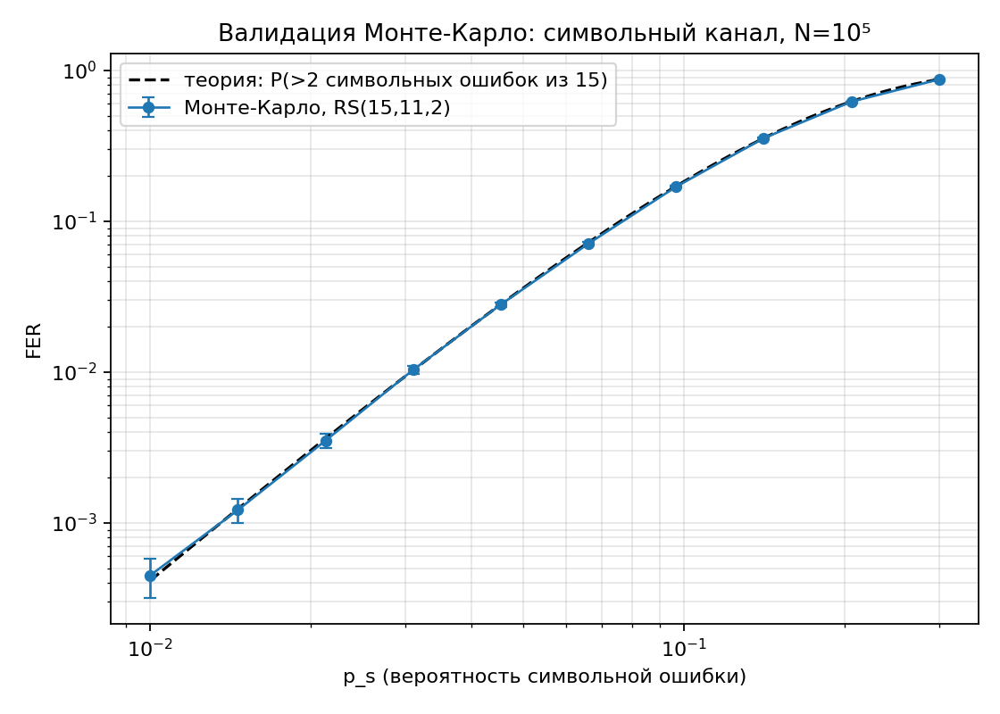
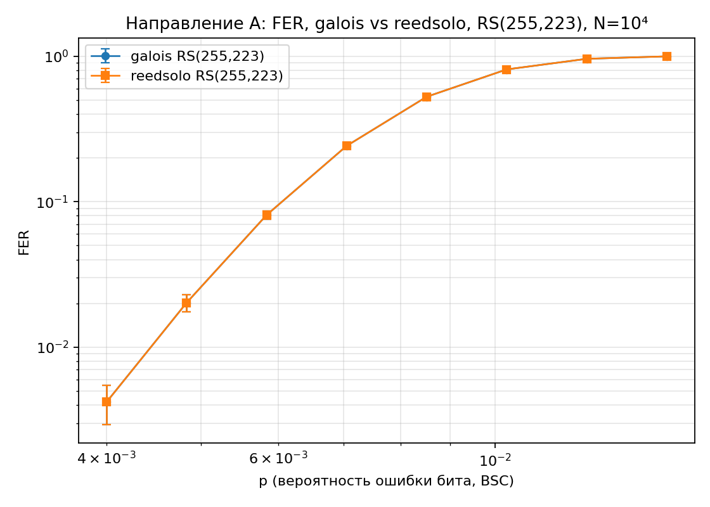
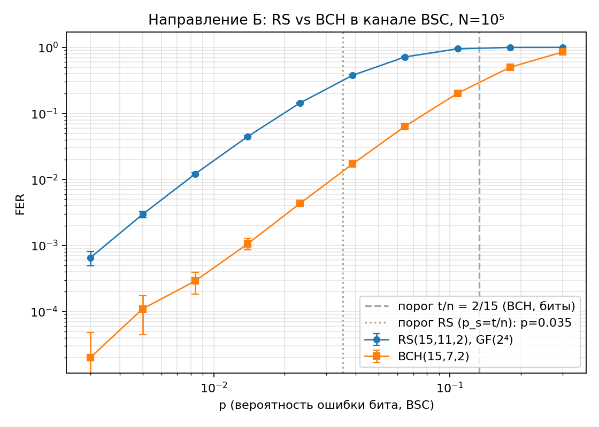
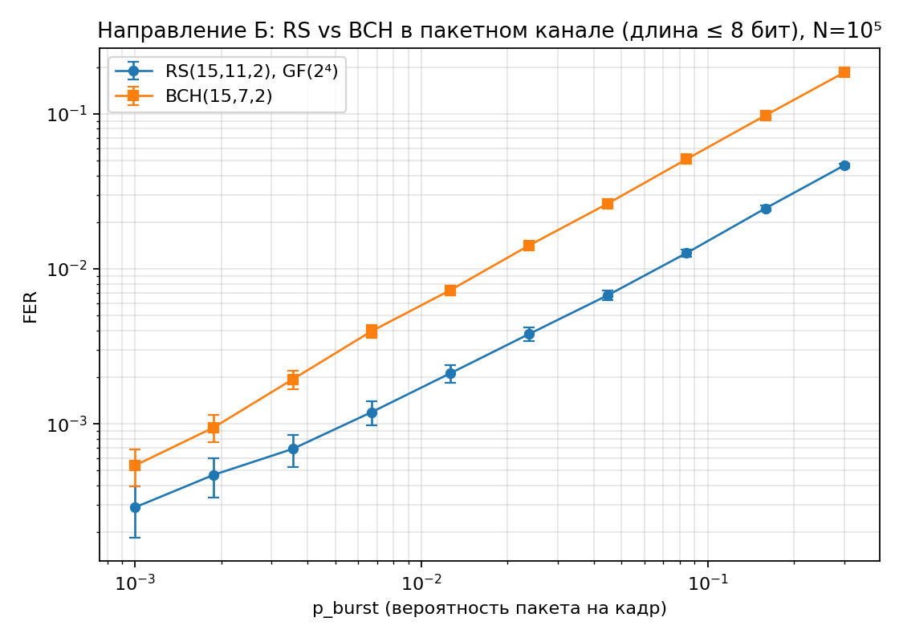

<!--
PDF собирается командой:  bash report/build.sh   (pandoc + lualatex, шрифт CMU Serif)
Формулы записаны в LaTeX ($...$) и корректно отображаются в PDF и на GitHub.
Репозиторий: https://github.com/VadimDenisovich/fundamentals-of-cybernetics (каталог coding-theory/)
-->

# 1. Введение

## 1.1 Цель работы

Провести сравнительный анализ помехоустойчивости кодов Рида–Соломона (РС) и БЧХ (BCH) с использованием готовых библиотек кодирования/декодирования по двум направлениям:

- **(А)** сравнение двух независимых реализаций одного и того же кода;
- **(Б)** сравнение режимов работы кодов — разных кодов с одинаковой исправляющей способностью и разных моделей каналов.

## 1.2 Краткий обзор кодов РС и BCH

**Коды БЧХ** — циклические коды, исправляющие кратные ошибки. Двоичный BCH-код длины $n = 2^m - 1$ с исправляющей способностью $t$ задаётся порождающим многочленом $g(x) = \mathrm{НОК}\big(M_1(x), M_3(x), \dots, M_{2t-1}(x)\big)$, где $M_i(x)$ — минимальный многочлен элемента $\alpha^i$ поля $\mathrm{GF}(2^m)$. Корнями $g(x)$ служат $\alpha, \alpha^2, \dots, \alpha^{2t}$, что гарантирует конструктивное расстояние $d \ge 2t + 1$.

**Коды Рида–Соломона** — недвоичные BCH-коды, у которых алфавит символов совпадает с полем локаторов: символы — элементы $\mathrm{GF}(q)$, длина $n = q - 1$, порождающий многочлен $g(x) = (x - \alpha)(x - \alpha^2)\cdots(x - \alpha^{2t})$ степени $n - k = 2t$. РС — МДР-коды (достигают границы Синглтона $d = n - k + 1$) и исправляют любые $t = (n-k)/2$ **символьных** ошибок. Поскольку ошибка в символе «стоит» одинаково независимо от числа испорченных бит внутри него, РС особенно эффективны против пакетных ошибок.

**Декодирование обоих классов** идёт по единой схеме:

1. вычисление синдромов $S_i = r(\alpha^i),\; i = 1, \dots, 2t$;
2. нахождение многочлена локаторов ошибок $\Lambda(x)$ — **алгоритм Берлекэмпа–Месси (БМ)**;
3. поиск корней $\Lambda(x)$ перебором — **процедура Чиеня**: позиции ошибок $j$ удовлетворяют $\Lambda(\alpha^{-j}) = 0$;
4. для недвоичных кодов — значения ошибок по **формуле Форни** $e_j = \Omega(X_j^{-1}) / \Lambda'(X_j^{-1})$, где $\Omega(x) = S(x)\Lambda(x) \bmod x^{2t}$ (для двоичных кодов значение ошибки равно $1$ — бит инвертируется).

Ниже оба алгоритма продемонстрированы письменно на примерах в $\mathrm{GF}(2^3)$. Все вычисления продублированы скриптом [`tools/verify_manual_examples.py`](tools/verify_manual_examples.py) (независимая реализация арифметики поля и БМ без библиотеки `galois`); кодовые слова используются как валидационные векторы.

### Поле $\mathrm{GF}(2^3)$

Поле строится по примитивному многочлену $p(x) = x^3 + x + 1$; примитивный элемент $\alpha$ — корень $p(x)$, откуда $\boldsymbol{\alpha^3 = \alpha + 1}$. Элементы (запись битами $b_2 b_1 b_0 \leftrightarrow b_2\alpha^2 + b_1\alpha + b_0$):

| Степень | Многочлен | Биты | Целое |
|:---:|:---:|:---:|:---:|
| $0$ | $0$ | $000$ | $0$ |
| $\alpha^0$ | $1$ | $001$ | $1$ |
| $\alpha^1$ | $\alpha$ | $010$ | $2$ |
| $\alpha^2$ | $\alpha^2$ | $100$ | $4$ |
| $\alpha^3$ | $\alpha + 1$ | $011$ | $3$ |
| $\alpha^4$ | $\alpha^2 + \alpha$ | $110$ | $6$ |
| $\alpha^5$ | $\alpha^2 + \alpha + 1$ | $111$ | $7$ |
| $\alpha^6$ | $\alpha^2 + 1$ | $101$ | $5$ |

Сложение — поразрядный XOR ($\oplus$) битовых записей; умножение — сложение степеней по модулю $7$ (так как $\alpha^7 = 1$). В поле характеристики $2$ вычитание совпадает со сложением.

### Пример 1. Код РС$(7,3)$, $t = 2$ над $\mathrm{GF}(2^3)$

Параметры: $n = 7$, $k = 3$, $n - k = 4 = 2t$, $d = 5$, исправляет $t = 2$ символьные ошибки.

**Порождающий многочлен** $g(x) = (x + \alpha)(x + \alpha^2)(x + \alpha^3)(x + \alpha^4)$. Раскрываем попарно:

- $(x + \alpha)(x + \alpha^2) = x^2 + (\alpha \oplus \alpha^2)x + \alpha^3 = x^2 + \alpha^4 x + \alpha^3$, ведь $\alpha \oplus \alpha^2 = 010 \oplus 100 = 110 = \alpha^4$;
- $(x + \alpha^3)(x + \alpha^4) = x^2 + (\alpha^3 \oplus \alpha^4)x + \alpha^7 = x^2 + \alpha^6 x + 1$, ведь $\alpha^3 \oplus \alpha^4 = 011 \oplus 110 = 101 = \alpha^6$.

Перемножая, $(x^2 + \alpha^4 x + \alpha^3)(x^2 + \alpha^6 x + 1)$ даёт

$$g(x) = x^4 + \alpha^3 x^3 + x^2 + \alpha x + \alpha^3.$$

(Например, коэффициент при $x^3$: $\alpha^6 \oplus \alpha^4 = 101 \oplus 110 = 011 = \alpha^3$; при $x$: $\alpha^4 \oplus \alpha^9 = \alpha^4 \oplus \alpha^2 = 110 \oplus 100 = 010 = \alpha$.)

**Кодирование (систематическое).** Сообщение $m = (\alpha,\, 1,\, \alpha^3)$, то есть $m(x) = \alpha x^2 + x + \alpha^3$. Кодовое слово $c(x) = m(x)\,x^4 + r(x)$, где $r(x) = m(x)\,x^4 \bmod g(x)$. Деление $m(x)x^4 = \alpha x^6 + x^5 + \alpha^3 x^4$ на $g(x)$ «столбиком»:

| Шаг | Член частного | Текущий остаток |
|:---:|:---:|:---|
| 1 | $\alpha x^2$ | $\alpha^5 x^5 + x^4 + \alpha^2 x^3 + \alpha^4 x^2$ |
| 2 | $\alpha^5 x$ | $\alpha^3 x^4 + \alpha^3 x^3 + \alpha^3 x^2 + \alpha x$ |
| 3 | $\alpha^3$ | $r(x) = \alpha^4 x^3 + \alpha^2 x + \alpha^6$ |

Итог:

$$c(x) = \alpha x^6 + x^5 + \alpha^3 x^4 + \alpha^4 x^3 + \alpha^2 x + \alpha^6, \qquad c = (\alpha,\, 1,\, \alpha^3,\, \alpha^4,\, 0,\, \alpha^2,\, \alpha^6).$$

Проверка: $c(\alpha^i) = 0$ для $i = 1,\dots,4$ — слово принадлежит коду (подтверждено; кодер `galois` даёт то же слово — *валидационный вектор №1*).

**Канал.** Вносим две ошибки $e(x) = \alpha^2 x^5 + \alpha x^2$. Принято $r = c \oplus e = (\alpha,\, \alpha^6,\, \alpha^3,\, \alpha^4,\, \alpha,\, \alpha^2,\, \alpha^6)$.

**Декодирование. Синдромы** $S_i = r(\alpha^i) = e(\alpha^i)$. Развёрнуто для $S_1$:

$$S_1 = r(\alpha) = 1 \oplus \alpha^4 \oplus 1 \oplus 1 \oplus \alpha^6 = \alpha^4 \oplus \alpha^6 \oplus 1 = 110 \oplus 101 \oplus 001 = 010 = \alpha,$$

аналогично $S_2 = 0,\; S_3 = \alpha,\; S_4 = \alpha^4$. Итак $S = (\alpha,\, 0,\, \alpha,\, \alpha^4)$.

**Алгоритм Берлекэмпа–Месси.** Начало: $\Lambda(x) = 1,\; B(x) = 1,\; L = 0$. Дискрепанс $d = S_k \oplus \sum_{i=1}^{L} \lambda_i S_{k-i}$; при $d \ne 0$ коррекция $\Lambda(x) \leftarrow \Lambda(x) \oplus d\,x\,B(x)$.

| $k$ | $S_k$ | дискрепанс $d$ | $\Lambda(x)$ | $L$ | $B(x)$ |
|:---:|:---:|:---:|:---|:---:|:---:|
| 1 | $\alpha$ | $\alpha$ | $1 + \alpha x$ | 1 | $\alpha^6$ |
| 2 | $0$ | $\alpha^2$ | $1$ | 1 | $\alpha^6 x$ |
| 3 | $\alpha$ | $\alpha$ | $1 + x^2$ | 2 | $\alpha^6$ |
| 4 | $\alpha^4$ | $\alpha^4$ | $1 + \alpha^3 x + x^2$ | 2 | $\alpha^6 x$ |

$$\boxed{\;\Lambda(x) = 1 + \alpha^3 x + x^2,\quad \deg\Lambda = L = 2 \;\Rightarrow\; \text{две ошибки.}\;}$$

**Процедура Чиеня** — перебор $j = 0,\dots,6$, корни $\Lambda(\alpha^{-j}) = 0$:

| $j$ | $\alpha^{-j}$ | $\Lambda(\alpha^{-j})$ | |
|:---:|:---:|:---:|:---|
| 2 | $\alpha^5$ | $1 \oplus \alpha^3\!\cdot\!\alpha^5 \oplus \alpha^{10} = 1 \oplus \alpha \oplus \alpha^3 = 0$ | $\leftarrow$ ошибка в $x^2$ |
| 5 | $\alpha^2$ | $1 \oplus \alpha^3\!\cdot\!\alpha^2 \oplus \alpha^4 = 1 \oplus \alpha^5 \oplus \alpha^4 = 0$ | $\leftarrow$ ошибка в $x^5$ |

(Остальные $j$ дают ненулевое значение.) Локаторы $X_1 = \alpha^2,\; X_2 = \alpha^5$ — ошибки в позициях $x^2$ и $x^5$. Проверка факторизации: $(1 + \alpha^2 x)(1 + \alpha^5 x) = 1 + \alpha^3 x + x^2$. $\checkmark$

**Формула Форни.** $\Omega(x) = S(x)\Lambda(x) \bmod x^4 = \alpha + \alpha^4 x$; производная $\Lambda'(x) = \alpha^3$ (член $x^2$ в характеристике $2$ исчезает). Тогда

$$e_2 = \frac{\Omega(\alpha^5)}{\Lambda'(\alpha^5)} = \frac{\alpha^4}{\alpha^3} = \alpha, \qquad e_5 = \frac{\Omega(\alpha^2)}{\Lambda'(\alpha^2)} = \frac{\alpha^5}{\alpha^3} = \alpha^2.$$

**Исправление.** $\hat c = r \oplus e$ восстанавливает $c = (\alpha,1,\alpha^3,\alpha^4,0,\alpha^2,\alpha^6)$ и сообщение $m = (\alpha, 1, \alpha^3)$. $\checkmark$

### Пример 2. Код BCH$(7,4)$, $t = 1$ над $\mathrm{GF}(2)$

Двоичный narrow-sense BCH длины $n = 7$ (эквивалент кода Хэмминга). Порождающий многочлен — минимальный многочлен элемента $\alpha$: $g(x) = x^3 + x + 1$, $n - k = 3$, $k = 4$. Корни $\alpha, \alpha^2, \alpha^4$ (среди них $\alpha, \alpha^2$ подряд $\Rightarrow d \ge 3$).

**Кодирование.** $m = (1,0,0,1)$, $m(x) = x^3 + 1$. Деление $m(x)x^3 = x^6 + x^3$ на $g(x)$ даёт остаток $r(x) = x^2 + x$, откуда $c(x) = x^6 + x^3 + x^2 + x$, $c = (1,0,0,1,1,1,0)$. Проверка $c(\alpha) = 0$ $\checkmark$ (*валидационный вектор №2*).

**Канал.** Ошибка в позиции $x^4$: $r = (1,0,1,1,1,1,0)$.

**Синдромы.** $S_1 = r(\alpha) = \alpha^6 \oplus \alpha^4 \oplus \alpha^3 \oplus \alpha^2 \oplus \alpha = 110 = \alpha^4$; $S_2 = S_1^2 = \alpha^8 = \alpha$ (в характеристике $2$ верно $r(\alpha^2) = r(\alpha)^2$).

**БМ.** На $k=1$: $d = \alpha^4 \Rightarrow \Lambda = 1 + \alpha^4 x,\; L = 1$. На $k=2$: $d = S_2 \oplus \lambda_1 S_1 = \alpha \oplus \alpha^4\!\cdot\!\alpha^4 = \alpha \oplus \alpha = 0$ — без изменений. Итог $\Lambda(x) = 1 + \alpha^4 x$.

**Корень.** $\Lambda(\alpha^{-j}) = 0 \Leftrightarrow \alpha^j = \alpha^4 \Leftrightarrow j = 4$. Код двоичный — инвертируем бит в позиции $x^4$:

$$\hat c = (1,0,0,1,1,1,0) = c, \qquad m = (1,0,0,1). \checkmark$$

## 1.3 Два направления сравнения

- **Направление А** — реализация одного кода РС$(255,223,16)$ над $\mathrm{GF}(2^8)$ библиотеками `galois` и `reedsolo` в идентичных условиях (канал BSC, общие $N_{\text{blocks}}$, $p$, seed); измеряются FER, BER и время декодирования на блок.
- **Направление Б** — на одной библиотеке (`galois`, чтобы исключить фактор реализации) сравниваются коды РС$(15,11,2)$ над $\mathrm{GF}(2^4)$ и двоичный BCH$(15,7,2)$ (оба $n=15$, $t=2$) в каналах BSC и Burst (пакет до $8$ бит).

---

# 2. Методология

## 2.1 Используемые инструменты

| Библиотека | Версия | Назначение | Источник |
|:---|:---:|:---|:---|
| `galois` | 0.4.11 | Кодеки РС и BCH, арифметика $\mathrm{GF}(2^m)$ поверх numpy (JIT через numba) | [github](https://github.com/mhostetter/galois) |
| `reedsolo` | 1.7.0 | Кодек РС на чистом Python (настраиваемые `fcr`, `prim`) | [github](https://github.com/tomerfiliba-org/reedsolomon) |
| `numpy` | 2.4.6 | Векторные операции, генератор PCG64 | [numpy.org](https://numpy.org) |
| `matplotlib` | 3.10.9 | Графики | [matplotlib.org](https://matplotlib.org) |
| `pytest` | 8.x | Тесты | [pytest.org](https://pytest.org) |

**Обоснование выбора.** `galois` и `reedsolo` — две наиболее распространённые Python-реализации РС с принципиально разной архитектурой: `galois` строит типизированные GF-массивы и компилирует операции через numba, `reedsolo` — компактная референсная реализация на чистом Python. Обе используют примитивный многочлен `0x11D` для $\mathrm{GF}(2^8)$ и декодер Берлекэмпа–Месси, что делает их сравнимыми. `galois` дополнительно предоставляет BCH-кодек, поэтому направление Б проводится внутри одной библиотеки. Модели каналов, цикл Монте-Карло, метрики и статистика реализованы самостоятельно ([`src/codingtheory/`](src/codingtheory)).

> **Согласование реализаций.** По умолчанию `galois.ReedSolomon` использует первый корень $\alpha^1$ (narrow-sense, $c=1$), а `reedsolo` — $\alpha^0$ ($\mathit{fcr}=0$). Для побайтовой идентичности кодовых слов в `reedsolo` задано $\mathit{fcr}=1$; идентичность проверена *валидационным вектором №4*.

## 2.2 Модели каналов

Все каналы реализованы самостоятельно ([`channels.py`](src/codingtheory/channels.py)), работают с кадрами битов и принимают внешний генератор случайных чисел (фиксированный seed $\Rightarrow$ воспроизводимость).

**BSC (двоичный симметричный канал).** Каждый бит независимо инвертируется с вероятностью $p$:

$$y_i = x_i \oplus e_i, \qquad e_i \sim \mathrm{Bernoulli}(p)\ \text{i.i.d.}$$

```text
для каждого бита x_i кадра:
    если rand() < p:  y_i = x_i XOR 1
    иначе:            y_i = x_i
```

**SymbolError (символьный канал).** Кадр делится на $m$-битные символы; каждый символ с вероятностью $p_s$ заменяется на случайный *другой* символ (XOR с равновероятной ненулевой маской из $\mathrm{GF}(2^m)\setminus\{0\}$):

$$s_i \leftarrow s_i \oplus u_i, \qquad u_i \sim \mathcal{U}\big(\mathrm{GF}(2^m)\setminus\{0\}\big)\ \text{с вер.}\ p_s.$$

```text
для каждого символа s_i (m бит):
    если rand() < p_s:  s_i = s_i XOR randint(1 .. 2^m-1)
```

**Burst (пакетный канал).** С вероятностью $p_{\text{burst}}$ на кадр вносится один пакет: непрерывный участок случайной длины $L \sim \mathcal{U}\{1,\dots,L_{\max}\}$ со случайным началом $s \sim \mathcal{U}\{0,\dots,n_{\text{bits}}-L\}$; биты участка инвертируются.

```text
если rand() < p_burst:
    L = randint(1 .. L_max);  s = randint(0 .. n_bits - L)
    для i в [s, s+L):  y_i = x_i XOR 1
```

Параметры: $p$ (BSC), $(p_s, m)$ (SymbolError), $(p_{\text{burst}}, L_{\max}{=}8)$ (Burst). Валидация: эмпирические частоты ошибок согласуются с заданными в пределах $4\sigma$, для Burst дополнительно проверены непрерывность пакета и ограничение длины (*вектор №5*, [`tests/test_channels.py`](tests/test_channels.py)).

## 2.3 Параметры эксперимента

| Параметр | Направление А | Направление Б |
|:---|:---|:---|
| Коды | РС$(255,223,16)$, $\mathrm{GF}(2^8)$ | РС$(15,11,2)$, $\mathrm{GF}(2^4)$ и BCH$(15,7,2)$ |
| Реализации | `galois` vs `reedsolo` | `galois` |
| Канал | BSC | BSC и Burst ($L \le 8$ бит) |
| $N_{\text{blocks}}$ / точку | $10^4$ | $10^5$ |
| $p$-сетка | $8$ точек, $[0.004;\,0.015]$ | BSC: $10$ точек $[0.003;\,0.3]$; Burst: $10$ точек $[0.001;\,0.3]$ |
| seed | $20260$ (общий) | $20261$ (общий) |

Коды направления Б имеют одинаковую длину $n = 15$ и одинаковую исправляющую способность $t = 2$, то есть одинаковую избыточность $n - k = 4$ в единицах алфавита. В битах избыточности различаются: BCH — $8$ бит на $15$-битный кадр ($53.3\%$), РС — $4$ символа $= 16$ бит на $60$-битный кадр ($26.7\%$); это различие обсуждается в §4.4.

$N_{\text{blocks}} = 10^5$ для направления Б обеспечивает значимость при $\mathrm{FER}\sim 10^{-3}$ ($\sim 100$ ошибочных кадров). Для направления А выбрано $N_{\text{blocks}} = 10^4$ (по критерию гипотезы А2, $N \ge 10^4$): декодер `reedsolo` на чистом Python сделал бы $10^5$ блоков многочасовыми без улучшения выводов — сравнение идёт в области «колена», где $\mathrm{FER} \ge 10^{-2}$.

## 2.4 Метрики и статистика

**FER** (Frame Error Rate) — доля кадров с ошибкой декодирования; кадр ошибочен, если декодированное сообщение $\ne$ переданному. При отказе декодера применяется одинаковая для всех обёрток стратегия passthrough (берётся информационная часть принятого слова).

$$\mathrm{FER} = \frac{N_{\text{err frames}}}{N_{\text{blocks}}}, \qquad \mathrm{BER} = \frac{N_{\text{err bits}}}{N_{\text{blocks}}\cdot k_{\text{bits}}}, \qquad \mathrm{Throughput} = \frac{N_{\text{blocks}}\cdot k_{\text{bits}}}{T_{\text{decode}}}\ \text{[бит/с]}.$$

Время измеряется только для операции декодирования; JIT-компиляция `galois` выполняется до замеров (warm-up).

**Доверительные интервалы (95%)** — интервал Вальда для доли $\hat p = k/N$:

$$\hat p \pm 1.96\,\sqrt{\frac{\hat p\,(1 - \hat p)}{N}}.$$

**Проверка значимости** — двухвыборочный $z$-тест для долей (pooled):

$$z = \frac{\hat p_1 - \hat p_2}{\sqrt{\bar p\,(1-\bar p)\,(1/N_1 + 1/N_2)}}, \quad \bar p = \frac{k_1 + k_2}{N_1 + N_2}, \quad \text{p-value} = \operatorname{erfc}\!\Big(\frac{|z|}{\sqrt 2}\Big);$$

различие значимо при $\text{p-value} < 0.05$.

**Валидация на известных векторах** ([`validation.py`](src/codingtheory/validation.py), входит в `pytest`):

1. РС$(7,3)$: ручное кодовое слово $(2,1,3,6,0,4,5)$ из §1.2 $=$ кодер `galois`;
2. BCH$(7,4)$: ручное слово $(1,0,0,1,1,1,0)$ из §1.2 $=$ кодер `galois`;
3. BCH$(15,7)$: $g(x)$ из `galois` $=$ табличный $g(x) = x^8 + x^7 + x^6 + x^4 + 1$ (Лин–Костелло, табл. 6.1);
4. РС$(255,223)$: `galois` и `reedsolo` ($\mathit{fcr}=1$) дают побайтово идентичные слова;
5. статистическая валидация трёх каналов.

Дополнительно кривая FER Монте-Карло для РС$(15,11,2)$ в символьном канале сопоставлена с точной теорией $\mathrm{FER} = 1 - \sum_{i=0}^{t} \binom{15}{i} p_s^{\,i}(1 - p_s)^{15 - i}$:



Эмпирическая кривая совпала с теоретической, «колено» проходит около $p_s \approx t/n = 2/15 \approx 0.133$ — цикл Монте-Карло и символьный канал корректны.

---

# 3. Результаты: Направление А (сравнение библиотек)

## 3.1 Гипотеза

> **А1.** `galois` и `reedsolo` дадут статистически неразличимые FER при декодировании РС$(255,223)$ в канале BSC, так как обе реализуют стандартный алгоритм Берлекэмпа–Месси.
>
> **А2.** `galois` будет в $3$–$5$ раз быстрее `reedsolo` благодаря векторизации через numpy, особенно при $N_{\text{blocks}} \ge 10^4$.

## 3.2 Эксперимент

Условия: код РС$(255,223,16)$, канал BSC, $p \in [0.004;\,0.015]$ ($8$ точек), $N_{\text{blocks}} = 10^4$, seed $20260$ (общий); `reedsolo` с $\mathit{fcr}=1$ — кодовые слова идентичны `galois`.




| $p$ | galois, мс/блок | reedsolo, мс/блок | galois/reedsolo | galois, кбит/с | reedsolo, кбит/с |
|:---:|:---:|:---:|:---:|:---:|:---:|
| 0.0040 | 110.07 | 2.26 | $\times 48.7$ | 16 | 789 |
| 0.0058 | 120.48 | 3.87 | $\times 31.1$ | 15 | 461 |
| 0.0085 | 108.96 | 2.07 | $\times 52.7$ | 16 | 863 |
| 0.0103 | 107.01 | 1.80 | $\times 59.5$ | 17 | 992 |
| 0.0150 | 102.37 | 1.65 | $\times 62.0$ | 17 | 1080 |

**В среднем `galois` в $\approx 52$ раза медленнее `reedsolo`.** (Полные таблицы: [`direction_a_timing.md`](results/direction_a_timing.md), [`direction_a_ztest.md`](results/direction_a_ztest.md).)

## 3.3 Статистическая проверка

| $p$ | FER galois | FER reedsolo | $z$ | p-value | различие |
|:---:|:---:|:---:|:---:|:---:|:---:|
| 0.0040 | $4.20\cdot10^{-3}$ | $4.20\cdot10^{-3}$ | $0.00$ | $1.000$ | незначимо |
| 0.0058 | $8.10\cdot10^{-2}$ | $8.10\cdot10^{-2}$ | $0.00$ | $1.000$ | незначимо |
| 0.0085 | $5.259\cdot10^{-1}$ | $5.259\cdot10^{-1}$ | $0.00$ | $1.000$ | незначимо |
| 0.0124 | $9.587\cdot10^{-1}$ | $9.587\cdot10^{-1}$ | $0.00$ | $1.000$ | незначимо |

На **всех** точках FER совпадает с точностью до одного ошибочного кадра: $z = 0$, $\text{p-value} = 1.000$. **Гипотеза А1 подтверждена** (в сильной форме).

## 3.4 Интерпретация

**Почему FER совпадает точно.** При общих seed, batch и $(n,k)$ обе библиотеки получают побайтово идентичные сообщения, кодовые слова (выравнивание $\mathit{fcr}$) и реализации шума. Декодер с ограниченным расстоянием детерминирован: кадр исправляется $\Leftrightarrow$ в нём $\le t = 16$ символьных ошибок — свойство принятого слова, а не реализации. Множества ошибочных кадров совпадают поэлементно, поэтому FER/BER равны точно; $z$-тест лишь формализует это.

**Почему `galois` в $\approx 52$ раза медленнее — гипотеза А2 опровергнута.** Векторизация numpy ускоряет арифметику поля, но декодер РС вызывается **поблочно**: БМ, Чиень и Форни для каждого из $10^4$ кадров — отдельный вызов с диспетчеризацией numba и аллокацией GF-массивов. Для длинного кода $n = 255$ фиксированные накладные расходы на блок ($\approx 110$ мс) доминируют. `reedsolo` — чистый Python, но это компактный однопроходный декодер одного блока без инфраструктурного overhead, и здесь он выигрывает на порядок. Векторизация `galois` раскрылась бы при батч-обработке многих коротких слов, но не в режиме «один длинный блок за вызов».

**Ответы на вопросы направления А.**

1. *Одинаковы ли FER/BER?* — Да, идентичны с точностью до кадра ($z=0$, $\text{p}=1.0$): один код, один алгоритм, одинаковый вход.
2. *Насколько отличается время и почему?* — `reedsolo` в $\approx 52$ раза быстрее на РС$(255,223)$; причина — накладные расходы `galois` на блок при длинном коде, где векторизация не реализуется.
3. *Что удобнее?* — `reedsolo`: простой байтовый API, мгновенный импорт, не требует numba. `galois` требовательнее (numba/llvmlite, JIT при первом вызове), но строго типизирован и единообразно работает с полем.
4. *Ограничения?* — `reedsolo` ориентирована на $\mathrm{GF}(2^8)$ и только РС; `galois` поддерживает произвольные $\mathrm{GF}(p^m)$, а также BCH/Хэмминга/линейные коды — что и использовано в направлении Б.

---

# 4. Результаты: Направление Б (сравнение режимов)

## 4.1 Гипотеза

> **Б1.** При пакетных ошибках длины $\le 8$ бит код РС$(15,11,2)$ покажет FER в $3$–$5$ раз ниже, чем BCH$(15,7,2)$ при той же избыточности, так как пакет затрагивает $\le 2$–$3$ символа в $\mathrm{GF}(2^4)$, но до $8$ битовых ошибок для двоичного кода.
>
> **Б3.** В BSC коды РС и BCH с одинаковой избыточностью покажут сопоставимый FER, но при переходе к пакетным ошибкам преимущество перейдёт к РС.

## 4.2 Эксперимент

Одна библиотека `galois`, коды РС$(15,11,2)$ и BCH$(15,7,2)$ (оба $n=15$, $t=2$), $N_{\text{blocks}} = 10^5$, seed $20261$, два канала.





## 4.3 Статистическая проверка

**Канал BSC** ($z > 0 \Rightarrow$ FER РС выше): различие значимо ($\text{p-value} < 10^{-3}$) на всех точках, BCH строго лучше.

| $p$ | FER РС | FER BCH | $z$ | p-value |
|:---:|:---:|:---:|:---:|:---:|
| 0.0083 | $1.214\cdot10^{-2}$ | $2.90\cdot10^{-4}$ | $+33.7$ | $<0.001$ |
| 0.0233 | $1.445\cdot10^{-1}$ | $4.35\cdot10^{-3}$ | $+119.4$ | $<0.001$ |
| 0.1078 | $9.519\cdot10^{-1}$ | $2.021\cdot10^{-1}$ | $+339.3$ | $<0.001$ |

**Пакетный канал** ($z < 0 \Rightarrow$ FER РС ниже): различие значимо на всех точках, РС строго лучше.

| $p_{\text{burst}}$ | FER РС | FER BCH | РС/BCH | $z$ | p-value |
|:---:|:---:|:---:|:---:|:---:|:---:|
| 0.0067 | $1.19\cdot10^{-3}$ | $3.96\cdot10^{-3}$ | $0.30$ | $-12.2$ | $<0.001$ |
| 0.0448 | $6.76\cdot10^{-3}$ | $2.636\cdot10^{-2}$ | $0.26$ | $-34.3$ | $<0.001$ |
| 0.3000 | $4.642\cdot10^{-2}$ | $1.846\cdot10^{-1}$ | $0.25$ | $-96.7$ | $<0.001$ |

Отношение $\mathrm{FER}_{\text{РС}}/\mathrm{FER}_{\text{BCH}} \approx 0.25$–$0.34$, то есть **РС даёт FER в $\approx 3$–$4$ раза ниже** — в диапазоне гипотезы Б1.

## 4.4 Интерпретация

«Одинаковая избыточность» в единицах алфавита различается в битах, а единицы исправления у кодов разные: РС считает **символьные** ($4$-битные) ошибки, BCH — **битовые**.

- **В BSC выигрывает BCH.** Независимые битовые ошибки рассеяны: символ $\mathrm{GF}(2^4)$ повреждается с вероятностью $\approx 1 - (1-p)^4 \approx 4p$. РС «развёрнут» в $60$ бит и при бюджете $t = 2$ символа имеет вчетверо бо́льшую экспозицию, тогда как BCH защищает короткий $15$-битный кадр вдвое большей долей проверочных бит. Итог — FER BCH на 1–2 порядка ниже. Это **уточняет Б3**: в BSC коды *не* сопоставимы.
- **В пакетном канале выигрывает РС.** Пакет $\le 8$ бит затрагивает $\le \lceil 8/4\rceil + 1 = 3$, чаще $\le 2$ соседних символа — в пределах $t = 2$ символа РС. Для двоичного BCH тот же пакет — до $8$ битовых ошибок, вчетверо больше бюджета $t = 2$. Поэтому FER РС в $\approx 3$–$4$ раза ниже. **Гипотеза Б1 подтверждена.**

**Как тип канала влияет на выбор кода.** Принципиально: кроссовер кривых (BCH ниже в BSC, РС ниже в Burst) — прямая иллюстрация. Для независимых ошибок предпочтительны двоичные коды с высокой битовой избыточностью; для пакетных — символьные коды (РС), где пакет «стягивается» в малое число символов. Поэтому РС применяют против пакетных искажений (CD/DVD, QR, DVB), часто с перемежением. **Часть Б3 о переходе преимущества к РС подтверждена.**

**Согласие с порогом $p \approx t/n$.** «Колено» FER ожидается там, где среднее число ошибок на кадр достигает $t$:

- BCH в BSC: порог $p \approx t/n = 2/15 \approx 0.133$; крутой рост FER приходится на эту окрестность ($\mathrm{FER} \approx 0.20$ при $p \approx 0.108$, $\mathrm{FER} \approx 0.50$ при $p \approx 0.18$).
- РС в BSC: порог по символам $p_s = t/n$, в битах $p = 1 - (1 - 2/15)^{1/4} \approx 0.035$; кривая РС даёт $\mathrm{FER} \approx 0.4$ уже при $p \approx 0.039$.
- РС в символьном канале (§2.4): «колено» при $p_s \approx 0.133$, эмпирика совпала с теорией — прямое подтверждение порога.

---

# 5. Заключение

1. **Инструменты реализованы и провалидированы:** три модели каналов (BSC, SymbolError, Burst), цикл Монте-Карло, метрики BER/FER/Throughput с 95%-ми доверительными интервалами и $z$-тестом. Корректность подтверждена $5$ известными векторами (включая ручные примеры §1 и побайтовое совпадение `galois` $\leftrightarrow$ `reedsolo`) и совпадением кривой Монте-Карло с точной теорией.

2. **Направление А.** Две реализации РС$(255,223)$ дают **идентичные** FER/BER ($z = 0$, $\text{p-value} = 1.0$) — гипотеза А1 подтверждена. По скорости `reedsolo` в $\approx 52$ раза **быстрее** `galois` при поблочном декодировании — гипотеза А2 (об ускорении `galois` в $3$–$5$ раз) **опровергнута**; причина — накладные расходы `galois` на вызов при гранулярности «один блок».

3. **Направление Б.** При равной символьной избыточности помехоустойчивость определяется структурой ошибок канала: в BSC лучше **BCH$(15,7)$** (на 1–2 порядка по FER), в пакетном канале лучше **РС$(15,11)$** (FER в $\approx 3$–$4$ раза ниже). Гипотеза Б1 подтверждена, Б3 подтверждена в части пакетного канала и уточнена в части BSC. Положение «колена» согласуется с порогом $p \approx t/n$.

> **Главный вывод.** Выбор между РС и BCH при фиксированной избыточности диктуется не «силой» кода вообще, а соответствием единицы исправления (символ против бита) статистике ошибок канала. Выбор библиотеки — компромисс между удобством/скоростью (`reedsolo` для РС над $\mathrm{GF}(2^8)$) и общностью (`galois` для произвольных полей и BCH).

---

*Исходный код, тесты и сырые данные: [github.com/VadimDenisovich/fundamentals-of-cybernetics](https://github.com/VadimDenisovich/fundamentals-of-cybernetics), каталог `coding-theory/`. Воспроизведение: `pytest`, затем `python experiments/run_direction_a.py` и `run_direction_b.py`, графики — `python experiments/plot_results.py`. Сборка PDF — `bash report/build.sh`.*
